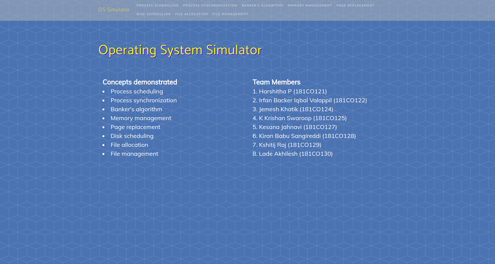
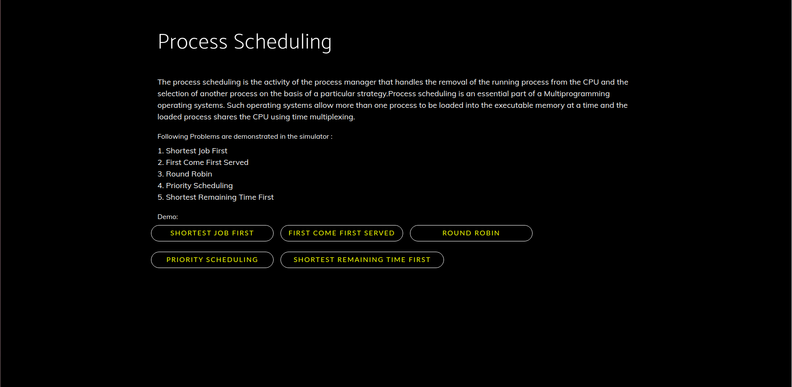
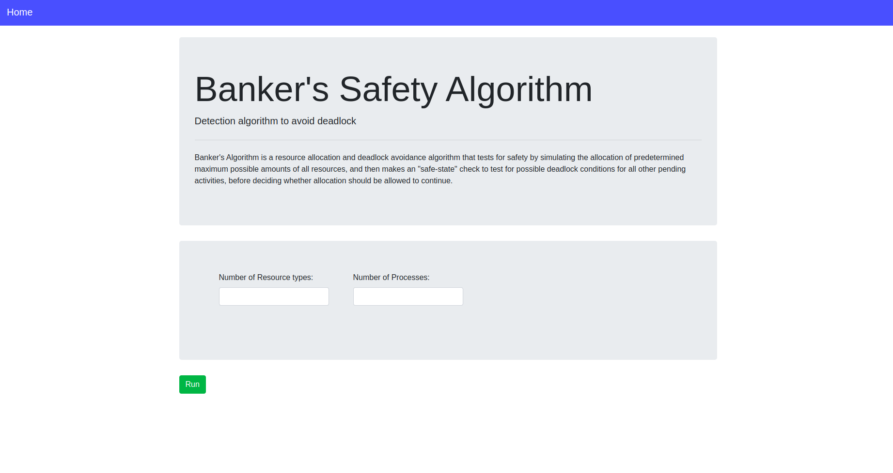

# OS-Simulator
This is an application built using Vanilla JS, HTML and CSS which simulates the Operating Systems Concepts.
### Screenshots

### Steps to Run
1. Unzip the package 
2. Open index.html using browser

### Team
1. **Mohammad Aadil Shabier** (211CS141)
2. **Muskan** (211CS142)
3. **Nancy Kumari** (211CS143)
4. **Prince Kumar Chaudhary** (211CS144)
5. **Rahul Dogra** (211CS145)
6. **Ridhisha Hede** (211CS146)
7. **Sai Anil Poreddiwar** (211CS148)
8. **Sailada Sowjanya** (211CS149)